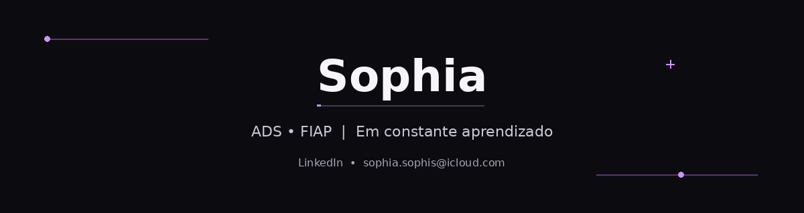

### Olá! Eu sou a Sophia 👋

**Estudante de Análise e Desenvolvimento de Sistemas na FIAP**

Explorando o mundo da tecnologia, aprendendo na prática e construindo projetos para evoluir como desenvolvedora.

---

## 👩🏻‍💻 Sobre mim

- 🎓 Cursando **Análise e Desenvolvimento de Sistemas na FIAP**.
- 🌱 Estou desenvolvendo minhas habilidades em programação e desenvolvimento de software.
- 💡 Gosto de aprender coisas novas, resolver problemas e transformar ideias em projetos.
- 🚀 Este perfil reúne meus estudos, experimentos e projetos ao longo da minha jornada.

## 🛠️ Tecnologias e ferramentas

## 📌 O que você vai encontrar por aqui

- Projetos e atividades da faculdade.
- Exercícios para praticar programação.
- Experimentos com desenvolvimento web e outras tecnologias.

## 📫 Contato

- **E-mail:** [sophia.sophis@icloud.com](mailto:sophia.sophis@icloud.com)
- **LinkedIn / contato:** [Meu LinkedIn](https://www.linkedin.com/in/sophia-silveira-9325493a1)

---

✨ *Obrigada por visitar meu perfil!*

**Sempre aprendendo, evoluindo e construindo algo novo.** 💜

